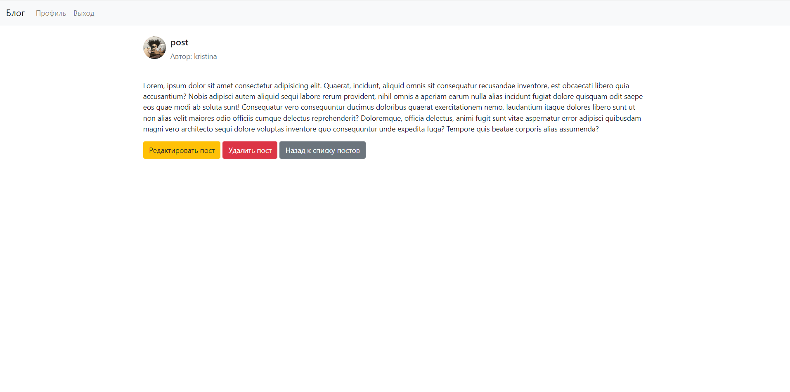

# Многопользовательский блог на Flask

Это приложение представляет собой многопользовательский блог, разработанный с использованием Flask. Пользователи могут
регистрироваться, создавать свои профили и публиковать посты. Блог поддерживает функциональность управления
пользователями и профилями, что позволяет делиться мыслями и идеями через записи.

## Функциональные возможности

- **Регистрация пользователей**: Новый пользователь может создать аккаунт с уникальным именем пользователя и адресом
  электронной почты.
- **Вход в систему**: Пользователи могут входить в систему, используя свои учетные данные.
- **Создание постов**: Аутентифицированные пользователи могут создавать новые посты.
- **Редактирование постов**: Пользователи могут редактировать свои посты.
- **Удаление постов**: Пользователи могут удалять свои посты.
- **Профиль пользователя**: Пользователи могут редактировать свой профиль, включая загрузку аватара.
- **Просмотр постов**: Все пользователи могут просматривать список всех постов и детальную информацию о каждом посте.

# Скриншоты

## Страница регистрации

## Страница входа

## Главная страница

## Страница профиля пользователя

## Страница создания нового поста

## Страница поста пользователя

## Страница редактирования поста


# Установка

Следуйте этим шагам для установки и запуска проекта на вашем локальном компьютере:

## 1. Клонирование репозитория

```bash
git clone https://github.com/markup-dev/flask-blog.git
```

## 2. Создание виртуального окружения

Рекомендуется использовать виртуальное окружение для управления зависимостями проекта. Создайте и активируйте
виртуальное окружение:

```bash
python -m venv venv
# Для Windows
venv\Scripts\activate
# Для macOS/Linux
source venv/bin/activate
```

## 3. Установка зависимостей

Убедитесь, что у вас установлен Python 3.x и pip. Установите необходимые зависимости:

```bash
pip install -r requirements.txt
```

## 4. Запуск сервера

Запустите сервер разработки:

```bash
python app.py
```

# Использование
- Перейдите на страницу регистрации (/register/) для создания нового аккаунта.
- Войдите в систему с помощью созданного аккаунта.
- Создайте новый пост или просмотрите существующие.
- Перейдите в свой профиль для изменения информации и изображения.

# Используемые технологии

- Flask: Веб-фреймворк на Python.
- Flask-SQLAlchemy: ORM для работы с базами данных.
- Flask-WTF: Расширение Flask для работы с формами.
- Flask-Login: Расширение Flask для управления аутентификацией пользователей.
- SQLite: Легковесная база данных, используемая в проекте.
- Bootstrap: CSS-фреймворк для стилизации интерфейса.